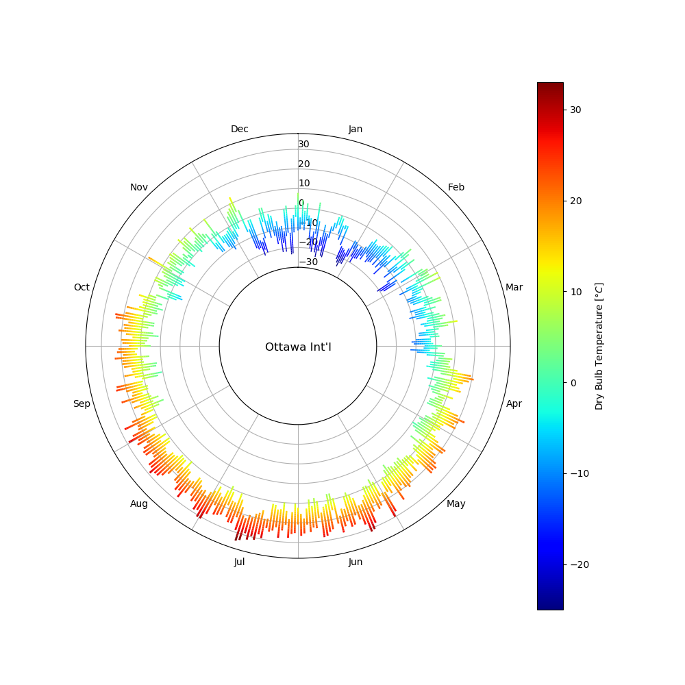

# ClimateRadials

I got inspired by [this](http://www.weather-radials.com) way of visualizing climate data with radial plots and wanted to recreate it in Python.

## Demo

[Link to demo](http://bit.ly/climateradials)


## Installation

Clone the repository and navigate into the repository folder:
```
pip install git+https://github.com/kastnerp/ClimateRadials@master
```

## Usage

It supports both a line and bar plot:

```python
from  climateradials import *

r = radial("C:\\DAYSIM\\wea\\CAN_ON_Ottawa_CWEC.epw")
r.plot_bars(export = True)
r.plot_line()
```

You may pass several arguments to change the appearance:

```
def plot_line(self, size=None, dpi=600, x=None, y=None, ymin=None, ymax=None,  yorigin=None, cmap=None, fileName=None, export=False):
```


## Results

### Bar plot




### Line plot


## Notes

The package contains a hardcopy of the [epw](https://github.com/building-energy/epw) package as it is not currently released as a package on `pip`.


## ToDo:
- [ ] Selection which variable to plot
- [ ] Incorporate precipitation
- [ ] Code readability
- [ ] Speed-up post-processing
- [ ] Python packaging for 'pip'
